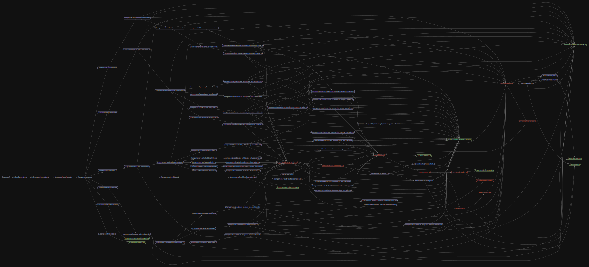

Redux Toolkit createEntityAdapter CRUD関数のplayground的なアプリケーション
- 各コンポーネントは以下
  - https://github.com/tyankatsu0105/sandbox-redux-toolkit-create-entity-adapter/tree/main/apps/client/components
- storeに関しては以下
  - https://github.com/tyankatsu0105/sandbox-redux-toolkit-create-entity-adapter/tree/main/apps/client/store/entities/users

`npx madge --image image.svg apps/client/pages/index.tsx`


## メモ
- `@hookform/devtools`は本来devDependenciesに入れるものだが、検証サイトということで、dependenciesに入れている。
- https://github.com/react-hook-form/devtools/issues/18
  - NODE_ENVで見せないように分岐させているので、強制的に見せる場合は`import * as ReactHookFormDevTool from '@hookform/devtools/dist/index.cjs.development.js';`
  - https://github.com/react-hook-form/devtools/issues/61
```js
// node_modules/@hookform/devtools/dist/index.js

'use strict'

if (process.env.NODE_ENV === 'production') {
  module.exports = {
    DevTool: () => null,
  };
} else {
  module.exports = require('./index.cjs.development.js')
}
```
- react hook formで`Controller`を使う場合は、asやrenderに渡すmaterialUIのコンポーネントのinputRef使用しない
  - ローカルだと入れても動くけど、デプロイしたらエラーになる
